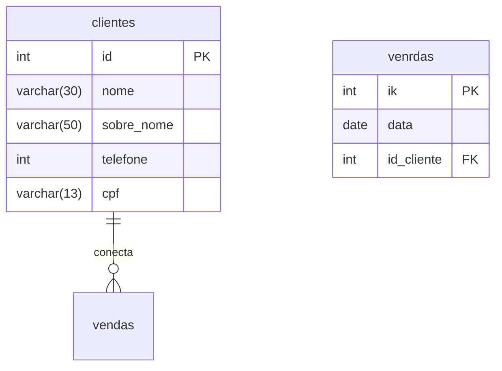

# Criando diagrama de tabela com a Mermaid

### Banco Estudos:

```mermaid
erDiagram 
    clientes {
        int id PK
        varchar(30) nome
        varchar(50) sobre_nome
        int telefone
        varchar(13) cpf
    }

    venrdas {
        int ik PK
        date data 
        int id_cliente FK
    }

    

    clientes ||--o{ vendas:"conecta"
```

