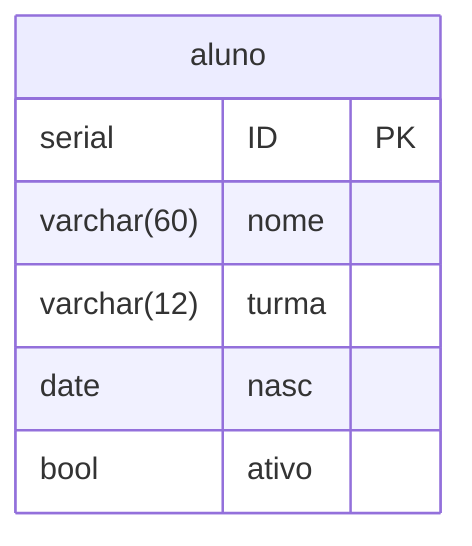

# CRUD com POSTGRESQL
- Create
- Read
- Update
- Delete

## Login com postgresql
1. Usando o usurário linux:
```bash
sudo -u postgres psql
```

**Nunca** Utilizar o postgres para gerenciamento de bancos e tabelas. (Não Utilizar na aplicação)

2. Usando usuario postgres:
 
```sql
psql -U escola -h localhost -d escola;
```
## Gerenciamento de DataBases
1. Criando um DataBase:
```sql
CREATE DATABASE escola;
```
2. Alterando DataBase:
```sql
ALTER DATABASE escola OWNER TO escola;
```

3. Apagando um DataBase:
```sql
DROP DATABASE escola;
```

## Gerenciamento de um usuário
1. Criando Usuário
```sql
CREATE USER escola WITH PASSWORD 'escola';
```
2. Alterando Usuário
```sql
ALTER USER escola WITH PASSWORD 'senha2';
```
---
## Diagrama da tabela:

---

