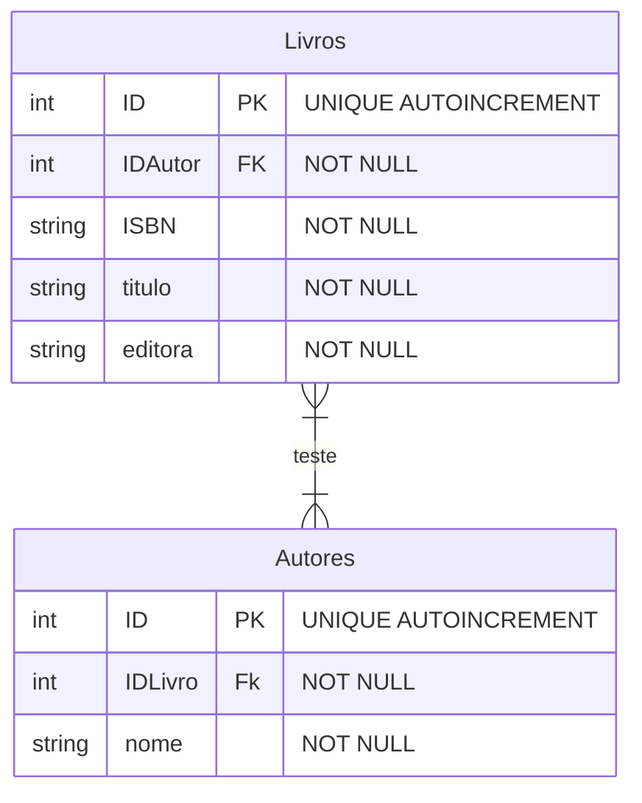
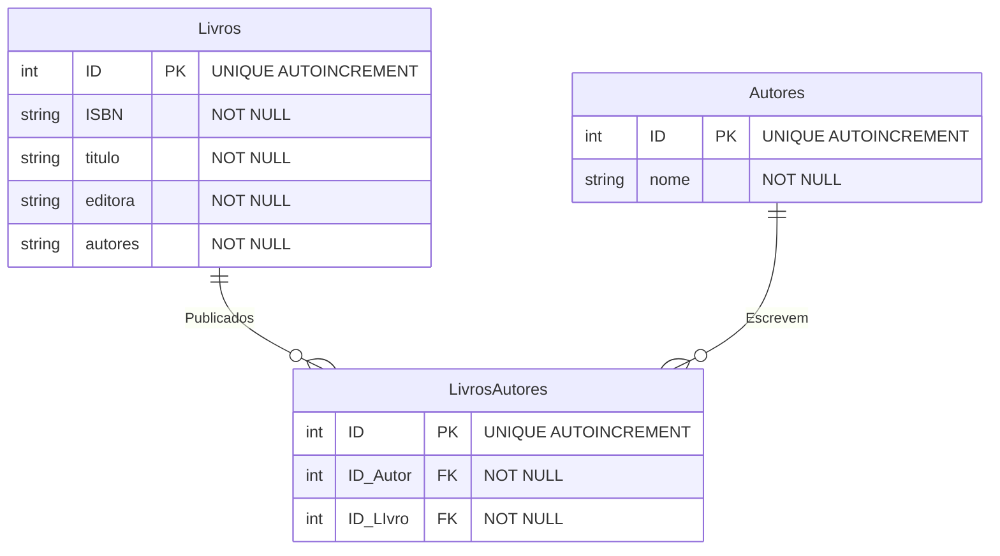
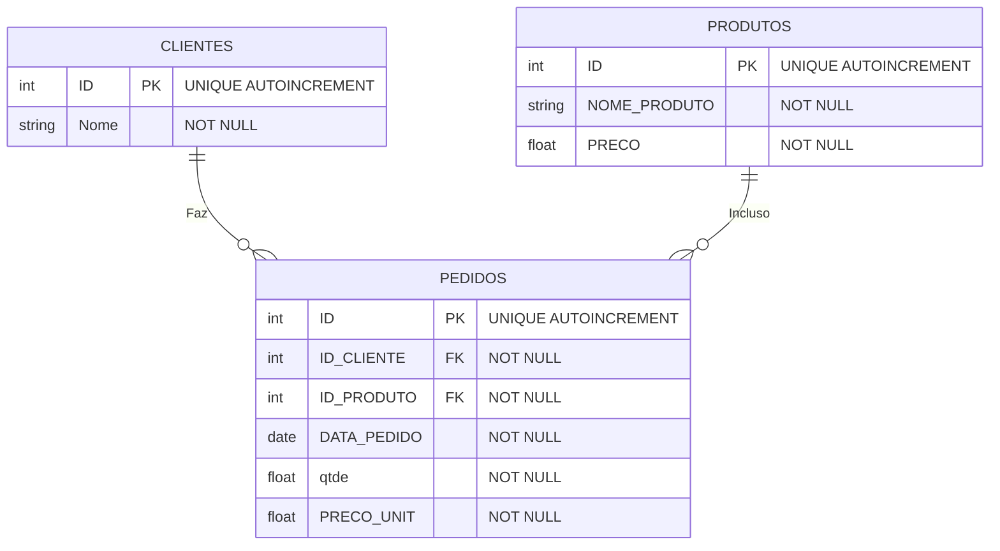
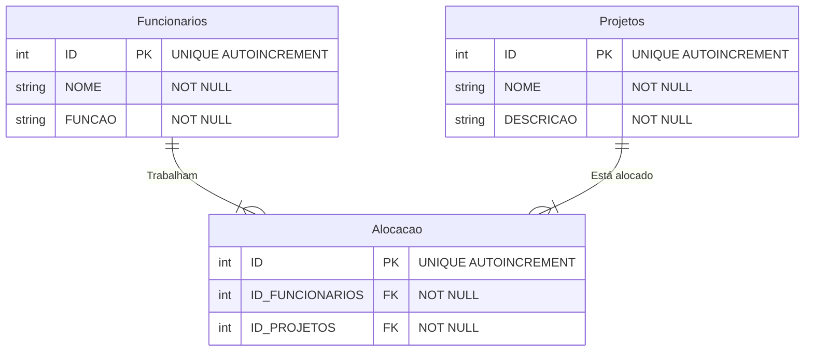

### atividade 02 CORREÇAO COM O MARCIO 

#### Primeira solução

```mermaid
erDiagram
Livros {
    int ID PK "UNIQUE AUTOINCREMENT"
    int IDAutor FK "NOT NULL"
    string ISBN "NOT NULL"
    string titulo "NOT NULL"
    string editora "NOT NULL"
}

Autores {
    int ID PK "UNIQUE AUTOINCREMENT"
    int IDLivro Fk "NOT NULL"
    string nome "NOT NULL"
}

Livros }|--|{ Autores:teste
``` 

#### Segunda solução
---

```mermaid
erDiagram
Livros {
    int ID PK "UNIQUE AUTOINCREMENT"
    string ISBN "NOT NULL"
    string titulo "NOT NULL"
    string editora "NOT NULL"
    string autores "NOT NULL"
}

Autores {
    int ID PK "UNIQUE AUTOINCREMENT"
    string nome "NOT NULL"
}

LivrosAutores {
    int ID PK "UNIQUE AUTOINCREMENT"
    int ID_Autor FK "NOT NULL"
    int ID_LIvro FK "NOT NULL"
}

Livros ||--o{ LivrosAutores:Publicados
Autores ||--o{ LivrosAutores:Escrevem
```

### Exercício 3 - Relatório de vendas
---

```mermaid
erDiagram
CLIENTES {
    int ID PK "UNIQUE AUTOINCREMENT"
    string Nome "NOT NULL"
}

PRODUTOS {
    int ID PK "UNIQUE AUTOINCREMENT"
    string NOME_PRODUTO "NOT NULL"
    float PRECO "NOT NULL"
}

PEDIDOS {
    int ID PK "UNIQUE AUTOINCREMENT"
    int ID_CLIENTE FK "NOT NULL"
    int ID_PRODUTO FK "NOT NULL"
    date DATA_PEDIDO "NOT NULL"
    float qtde "NOT NULL"
    float PRECO_UNIT "NOT NULL"
}

CLIENTES ||--o{ PEDIDOS : Faz
PRODUTOS ||--o{ PEDIDOS : "Incluso"
```

### Exercicio 05

```mermaid
erDiagram
    Funcionarios {
        int ID PK "UNIQUE AUTOINCREMENT"
        string NOME "NOT NULL"
        string FUNCAO "NOT NULL"
    }

    Projetos {
        int ID PK "UNIQUE AUTOINCREMENT"
        string NOME "NOT NULL"
        string DESCRICAO "NOT NULL"
    }

    Alocacao {
        int ID PK "UNIQUE AUTOINCREMENT"
        int ID_FUNCIONARIOS FK "NOT NULL"
        int ID_PROJETOS FK "NOT NULL"
    }

    Funcionarios ||--|{ Alocacao:"Trabalham"
    Projetos ||--|{ Alocacao:"Está alocado"
```