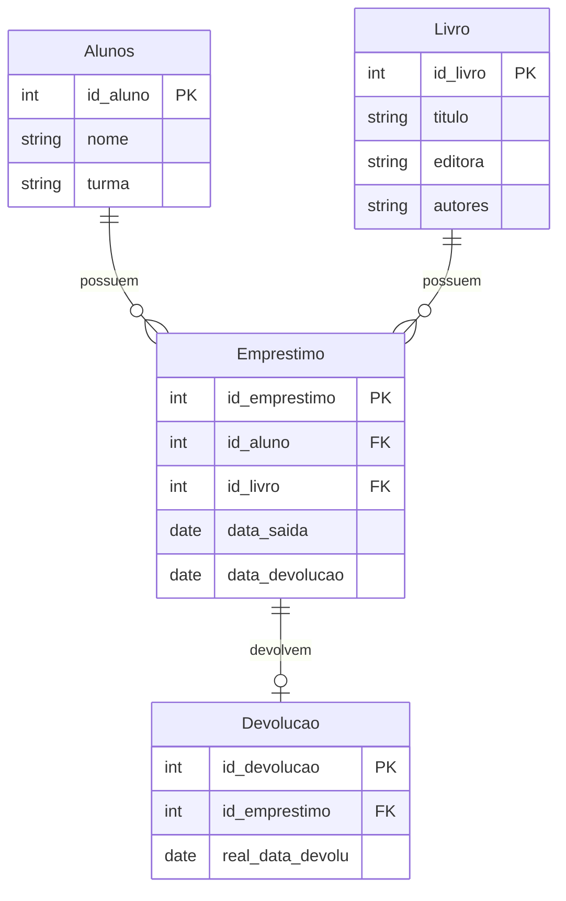

```mermaid
erDiagram
Alunos{
    int id_aluno PK
    string nome
    string turma
}

Livro{
    int id_livro PK 
    string titulo 
    string editora 
    string autores
}

Emprestimo{
    int id_emprestimo PK
    int id_aluno FK
    int id_livro FK
    date data_saida 
    date data_devolucao  
}

Devolucao{  
    int id_devolucao PK
    int id_emprestimo FK
    date real_data_devolu 
}

Alunos ||--o{ Emprestimo : "possuem"
Livro ||--o{ Emprestimo : "possuem"
Emprestimo ||--o| Devolucao : "devolvem"

```