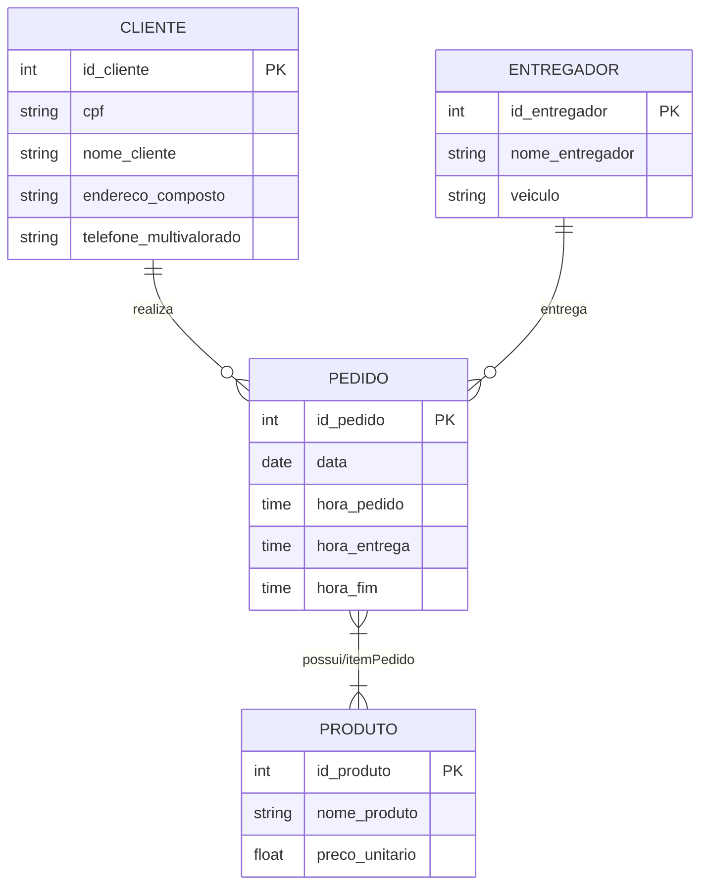

```mermaid
erDiagram
CLIENTE {
    int id_cliente PK
    string cpf
    string nome_cliente
    string endereco_composto
    string telefone_multivalorado
}

ENTREGADOR {
    int id_entregador PK
    string nome_entregador
    string veiculo
}

PEDIDO {
    int id_pedido PK
    date data
    time hora_pedido
    time hora_entrega
    time hora_fim
}

PRODUTO {
    int id_produto PK
    string nome_produto
    float preco_unitario
}

CLIENTE ||--o{ PEDIDO : "realiza"
ENTREGADOR ||--o{ PEDIDO : "entrega"
PEDIDO }|--|{ PRODUTO : "possui/itemPedido"

```