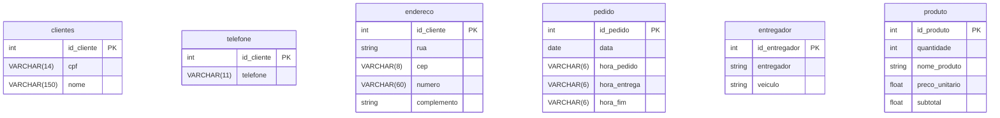

```mermaid
erDiagram
clientes{
    int id_cliente PK
    VARCHAR(14) cpf
    VARCHAR(150) nome
}

telefone{
    int id_cliente PK
    VARCHAR(11) telefone
}

endereco{
    int id_cliente PK
    string rua
    VARCHAR(8) cep
    VARCHAR(60) numero
    string complemento
}
pedido{
    int id_pedido PK
    date data
    VARCHAR(6) hora_pedido
    VARCHAR(6) hora_entrega
    VARCHAR(6) hora_fim
}

entregador{
    int id_entregador PK
    string entregador
    string veiculo
}

produto{
    int id_produto PK
    int quantidade
    string nome_produto
    float preco_unitario
    float subtotal
}


```