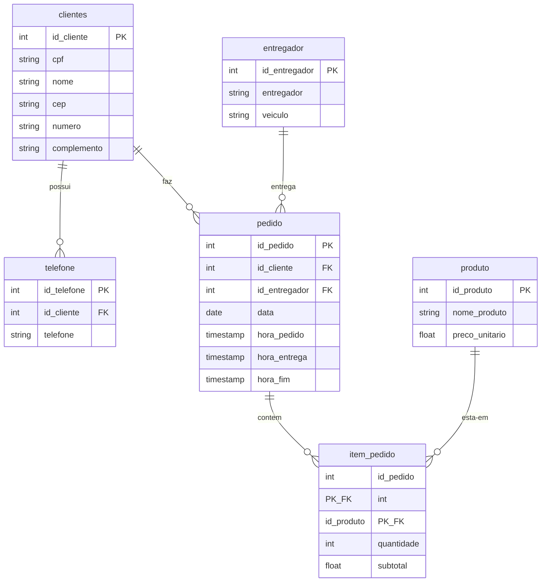

```mermaid
erDiagram
clientes {
    int id_cliente PK
    string cpf
    string nome
    string cep
    string numero
    string complemento
}

telefone {
    int id_telefone PK
    int id_cliente FK
    string telefone
}

entregador {
    int id_entregador PK
    string entregador
    string veiculo
}

pedido {
    int id_pedido PK
    int id_cliente FK
    int id_entregador FK
    date data
    timestamp hora_pedido
    timestamp hora_entrega
    timestamp hora_fim
}

produto {
    int id_produto PK
    string nome_produto
    float preco_unitario
}

item_pedido {
    int id_pedido PK_FK
    int id_produto PK_FK
    int quantidade
    float subtotal
}

clientes ||--o{ telefone : "possui"
clientes ||--o{ pedido : "faz"
entregador ||--o{ pedido : "entrega"
pedido ||--o{ item_pedido : "contem"
produto ||--o{ item_pedido : "esta-em"

```