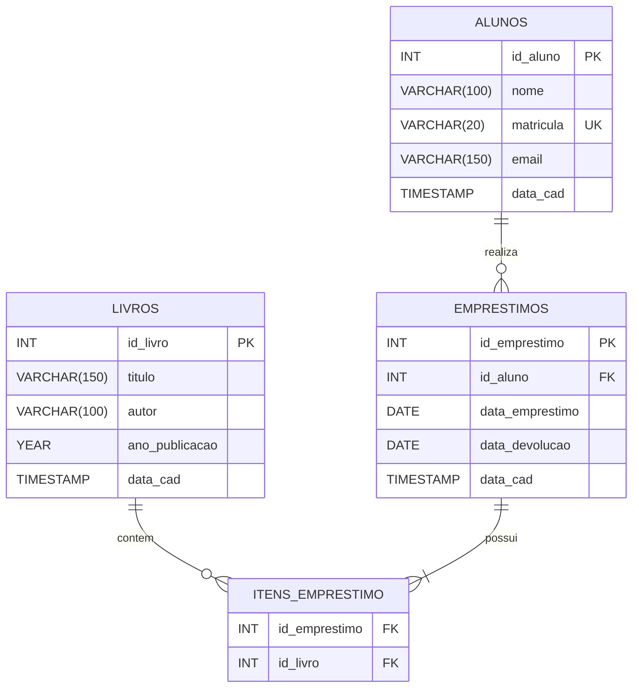

```mermaid
erDiagram

    ALUNOS {
        INT id_aluno PK
        VARCHAR(100) nome
        VARCHAR(20) matricula UK
        VARCHAR(150) email
        TIMESTAMP data_cad
    }

    LIVROS {
        INT id_livro PK
        VARCHAR(150) titulo
        VARCHAR(100) autor
        YEAR ano_publicacao
        TIMESTAMP data_cad
    }

    EMPRESTIMOS {
        INT id_emprestimo PK
        INT id_aluno FK
        DATE data_emprestimo
        DATE data_devolucao
        TIMESTAMP data_cad
    }

    ITENS_EMPRESTIMO {
        INT id_emprestimo FK
        INT id_livro FK
    }

        ALUNOS ||--o{ EMPRESTIMOS : "realiza"
    LIVROS ||--o{ ITENS_EMPRESTIMO : "contem"
    EMPRESTIMOS ||--|{ ITENS_EMPRESTIMO : "possui"

```